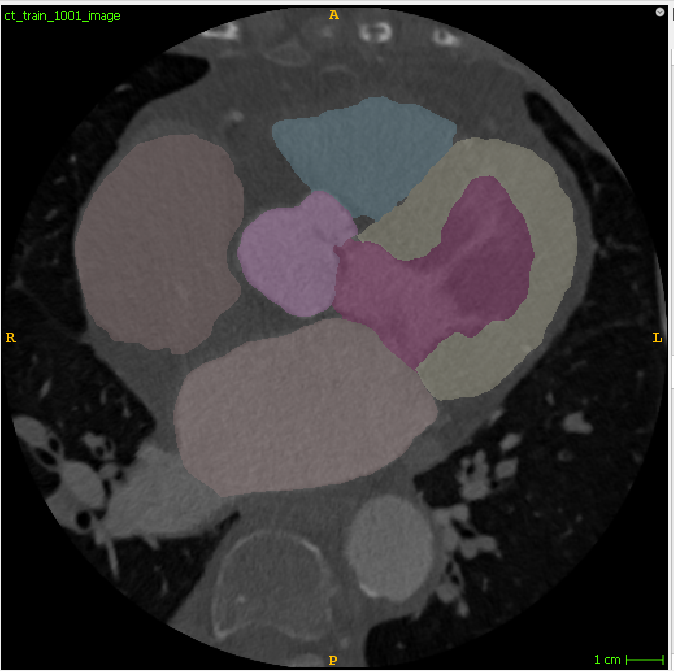

# ML-MRI-Feature-Extract
The project centers on the development and application of machine learning for the analysis of medical imaging data to automate the analysis and feature extraction, diagnosis or prognosis.

# UTSW 2018 Hack-Med

On  November 9 –10,  the UT  Southwestern  (UTSW)  Lyda  Hill  Department  of  Bioinformatics and community partners NCBI and Mark III Systems will host a hackathon on the UTSW campus in Dallas! The  hackathon  comes  just  two  days  prior  to  the  SC18  high-performance computing  conference  in downtown Dallas. The eventwill  focus  on computational  solutions  for  problems  in  clinical  medicine and genomics.  This  event  is  for researchers,  engineers  and developers, including  students  and postdocs, who have already engaged in the use of large datasets or in the development of pipelines for  analyses  from  high-throughput  experiments. 

# Team 9: Cardiac Segmentation

We aim to develop an automated deep-learning classifier that segments cardiac MRI and CT images. I.E. we will try and develop an automated system that will label different regions of the heart from both CT and MRI imaging, as seen in the exmple image below.

